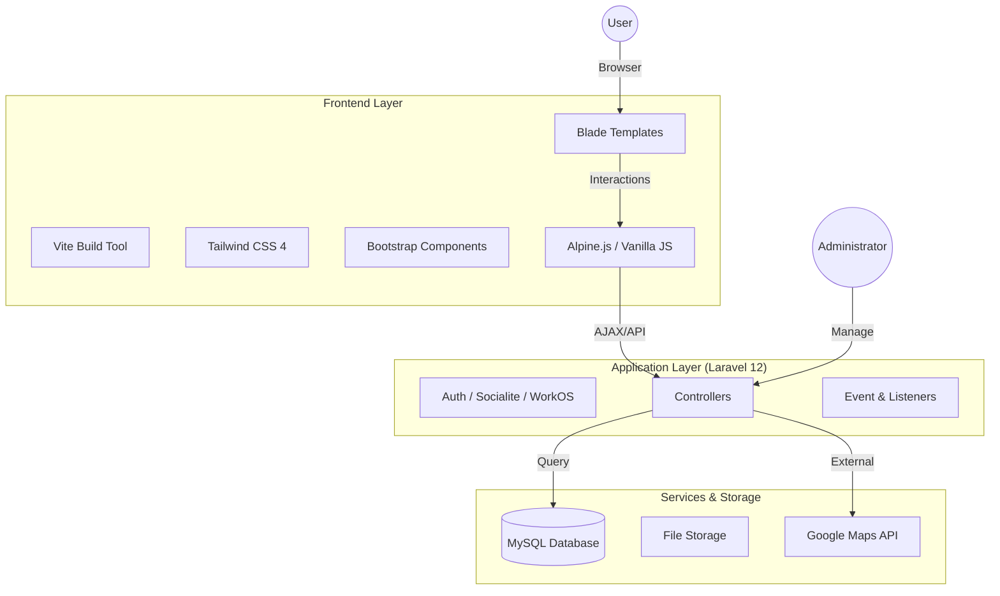

# QHub - School Bulletin Board App


**QHub** is a comprehensive bulletin board and community web application designed for students and teachers of **QQEnglish**.
It goes beyond simple posting, offering real-time communication, event management, and item sharing to foster a vibrant school community.

---

## 🏗️ System Architecture



---

## 🔧 Technologies Used

This project leverages a modern hybrid stack for performance and developer experience.

### Backend

* **Framework:** Laravel 12
* **Language:** PHP 8.2+
* **Authentication:** Laravel UI, Socialite, WorkOS
* **Database:** MySQL / SQLite (Dev)

### Frontend

* **Styling:** Tailwind CSS 4, Bootstrap 5 (Components), Sass
* **Scripting:** Alpine.js, Vanilla JavaScript
* **Build Tool:** Vite

### Key Libraries & Integrations

* **📅 Event Management:** FullCalendar (Daygrid, Timegrid)
* **🗺️ Maps:** Google Maps Services
* **🔐 Auth Integration:** WorkOS / Socialite
* **🧪 Testing:** PHPUnit

---

## ✨ Key Features

QHub is more than just a bulletin board. It includes:

### 📢 Community & Sharing

* **📝 Smart Posts:** Create, edit, and delete posts with multiple categories (Events, Foods, Items, Questions).
* **🖼️ Media Support:** Multiple image uploads for rich content.
* **💬 Engagement:** Comment capability with nested replies and specialized "Answer" interactions.
* **❤️ Reactions:** Like system for Posts and Answers.

### 🗓️ Organization & Tools

* **📅 Interactive Calendar:** Visual event management integrated with FullCalendar.
* **🤝 Item Exchange:** "Wanted" and "Giveaway" item listings.
* **🗺️ Location Context:** Google Maps integration for events and spots.

### 🛡️ Safety & Real-time

* **💬 Live Chat:** Real-time chat rooms and messaging functionality.
* **🚨 Reporting System:** Robust reporting tools for posts, comments, and users to ensure community safety.
* **👮 Admin Dashboard:** Comprehensive backend for user and content management.

---

## 🚀 Setup Guide

Follow these steps to get your development environment running in minutes.

### Prerequisites

* PHP >= 8.2
* Composer
* Node.js & npm

### Installation Steps

1. **Clone the repository**
```bash
git clone [https://github.com/yourusername/qhub.git](https://github.com/yourusername/qhub.git)
cd qhub

```


2. **Install Dependencies**
```bash
composer install
npm install

```


3. **Environment Configuration**
```bash
cp .env.example .env
php artisan key:generate

```


> **⚠️ Important:** You must configure your `DB_connection`, `Maps_API_KEY`, and Socialite credentials in the `.env` file.


4. **Database Setup**
```bash
# Create a database (e.g., qhub_db) then run:
php artisan migrate --seed

```


> The seeder will populate necessary master data (Categories, Report Reasons) and test users.


5. **Start Development Server**
```bash
# Terminal 1: Compile assets
npm run dev

# Terminal 2: Start Laravel server
php artisan serve

```


Access the app at `http://localhost:8000`.

---

## 👨‍💻 Development Team

| Name | Role | Focus Area |
| --- | --- | --- |
| **Masahiro Mikoshiba** | Project Manager / Backend | Architecture, API, Core Logic |
| **Jun Egami** | Frontend / UI | Design System, User Experience |
| **Shun Rowa** | Frontend / UI | Component Implementation, Layouts |
| **Yuki Takashima** | Quality Assurance | Testing, Bug Tracking |

---

## 🤝 Contributing

We welcome contributions!
Please see `/docs/CONTRIBUTING.md` (coming soon) for details on our branching strategy and coding standards.

---

## 📌 License

This project is licensed under the [MIT License](https://www.google.com/search?q=LICENSE).

```
